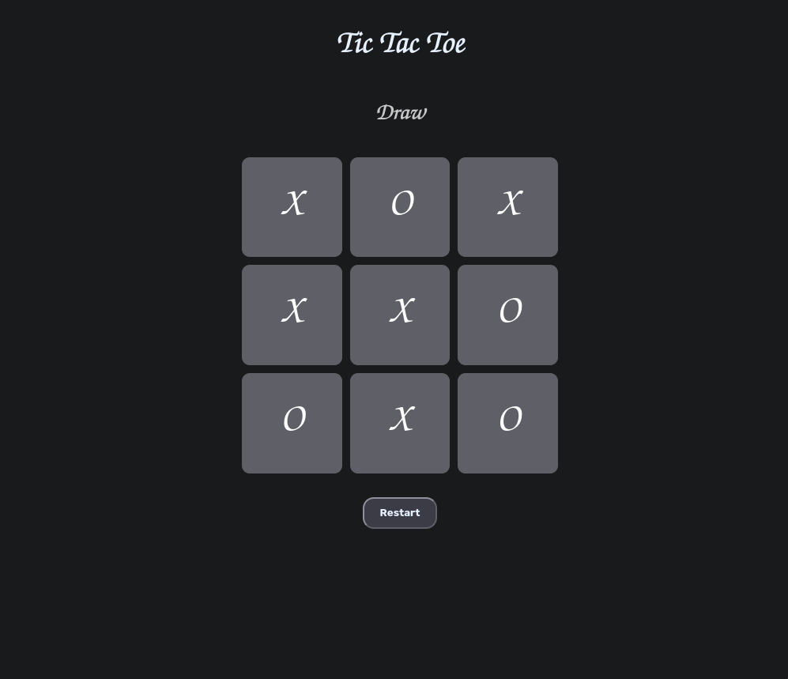
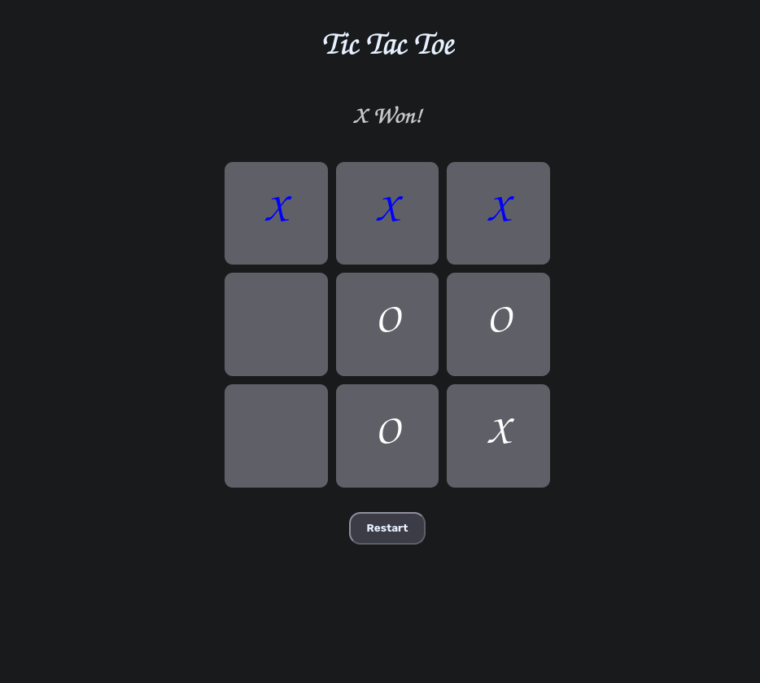

# 🎮 Tic-Tac-Toe (Vanilla JS)

A simple **Tic-Tac-Toe** game built using **only** HTML, CSS, and JavaScript.  
No frameworks, no build tools — just clean, minimal, and beginner-friendly code.

---

## 🚀 Features

- Classic 3×3 grid gameplay
- Player vs Player mode
- Highlight winning combinations
- Reset and replay support
- Fully responsive design

---

## 🧩 Tech Stack

- **HTML** – structure
- **CSS** – layout and design
- **JavaScript** – game logic and interactivity

---

## 📂 Project Structure

```
tictactoe-vanilla/
├── index.html
├── style.css
├── script.js
└── README.md
```

---

## 💡 How to Run

1. Clone the repository:
   ```bash
   git clone https://github.com/0xk-h/tictactoe-vanilla.git
   ```
2. Open index.html directly in your browser.
   (No server required — it’s 100% static!)

---

## 🎯 Future Ideas

- Add AI (Minimax algorithm) for single-player mode
- Track score history
- Add sound and animations

---

## 🖼️ Preview





---

## 🧠 Learnings

- DOM manipulation and event handling
- Game state management in JavaScript
- Responsive layout with CSS Grid

---

**Made with ❤️ using pure web fundamentals.**
